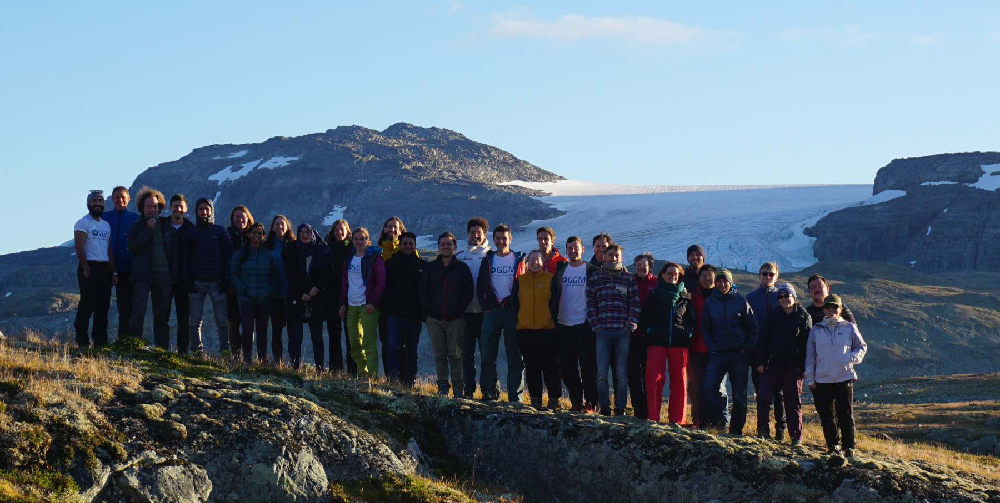

# {octicon}`home` OGGM community

The Open Global Glacier Model ([oggm.org](https://oggm.org)) is an open-source glacier model and also an online community! This webpage documents the community's purpose, leadership team and governance.


<small>*Group photo from the [OGGM workshop in Finse, Norway, 2022](https://oggm.org/2022/11/20/6st-oggm-worshop-summary/).*</small>

```{tableofcontents}
```
